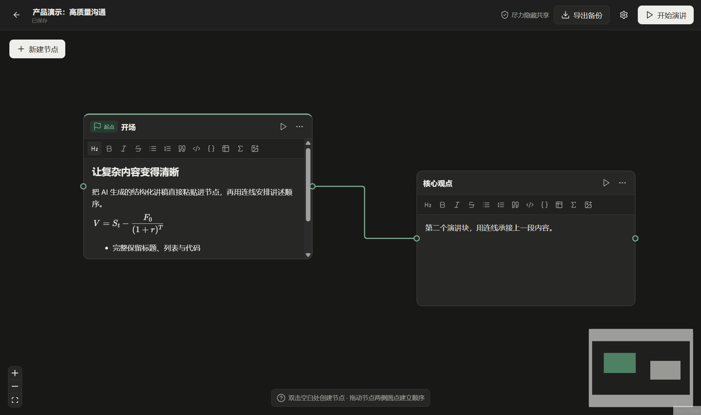

# 演讲台（Speech Desk）

[](https://github.com/wuzhuoye666/speech-desk/actions/workflows/ci.yml)
[](LICENSE)
[](#运行要求)

一款本地优先的 Windows 节点式讲稿编辑器与悬浮提词器。你可以在无限画布上拆分讲稿，用连线确定唯一的讲述顺序，再把当前段落显示在其他应用之上的独立提词窗中。



## 为什么使用演讲台

- **按思路组织，而不是按页组织**：每个节点是一段讲述内容，连线构成从起点开始的线性演讲路径。
- **编辑与演讲共用同一份内容**：标题、列表、表格、代码、任务列表、图片和 KaTeX 公式会直接进入提词窗。
- **数据保留在本机**：项目、设置和图片由 Electron 用户数据目录中的 SQLite 数据库及资源目录保存。
- **面向真实演示场景**：提词窗支持置顶、动态高度、限高滚动、鼠标穿透、全局快捷键和 Windows 捕获保护。
- **项目可迁移**：单个演讲及其图片可导出为 `.speechdesk` 备份并在另一台设备导入。

> [!IMPORTANT]
> 捕获保护调用 Windows 提供的尽力保护能力，无法保证兼容所有会议、录屏或采集软件。涉及保密内容时，请共享单个应用窗口或使用双显示器。

## 快速开始

### 运行要求

- Windows x64
- Node.js 22
- npm（随 Node.js 安装）

### 本地运行

```powershell
git clone https://github.com/wuzhuoye666/speech-desk.git
cd speech-desk
npm.cmd ci
npm.cmd run dev
```

PowerShell 执行策略可能会拦截 `npm.ps1`，因此 Windows 示例统一使用 `npm.cmd`。

### 验证与打包

```powershell
npm.cmd run check
npm.cmd run dist:win
```

`check` 会依次执行严格类型检查、28 项自动化测试和生产构建。Windows NSIS 安装包输出到 `release/`。

## 功能概览

| 区域 | 已实现能力 |
| --- | --- |
| 资料库 | 创建、搜索、复制、回收站、永久删除、自动保存 |
| 节点画布 | 缩放、平移、拖放、调整尺寸、显式起点、线性连线约束 |
| 富文本 | Markdown 粘贴、表格、代码高亮、任务列表、图片、KaTeX 公式 |
| 提词窗 | 置顶、动态高度、滚动、鼠标穿透、主题、字号、不透明度 |
| 演讲控制 | 节点前进/后退、内容滚动、显示切换、鼠标穿透切换 |
| 数据 | SQLite WAL、图片资源、`.speechdesk` 导入与导出 |

## 默认快捷键

| 操作 | 快捷键 |
| --- | --- |
| 下一节点 | `Alt+Right` |
| 上一节点 | `Alt+Left` |
| 向上 / 向下滚动 | `Alt+Up` / `Alt+Down` |
| 显示或隐藏提词窗 | `Alt+Shift+P` |
| 锁定或解锁鼠标穿透 | `Alt+Shift+L` |

快捷键可以在设置中修改。若新组合已被其他应用占用，演讲台会恢复上一次有效配置。

## 文档

- [从源码运行演讲台](docs/getting-started.md)：从安装依赖到完成第一场节点演讲。
- [使用指南](docs/user-guide.md)：编辑、连线、提词、备份和故障排查。
- [配置参考](docs/configuration.md)：全部主题、提词窗和快捷键默认值与约束。
- [架构说明](docs/architecture.md)：进程边界、IPC、SQLite、备份和演讲链设计。

## 参与项目

提交问题前请阅读 [贡献指南](CONTRIBUTING.md) 和 [安全策略](SECURITY.md)。行为要求见 [社区行为准则](CODE_OF_CONDUCT.md)。

## 许可证

[MIT](LICENSE) © 2026 wuzhuoye666
